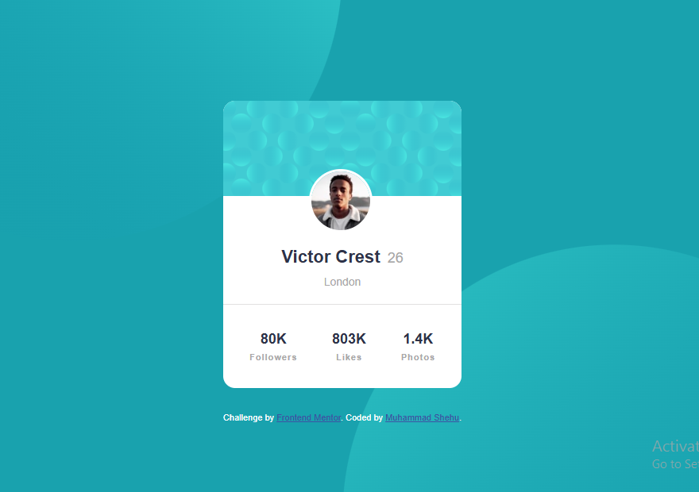

# Frontend Mentor - Profile card component solution

This is a solution to the [Profile card component challenge on Frontend Mentor](https://www.frontendmentor.io/challenges/profile-card-component-cfArpWshJ). Frontend Mentor challenges help you improve your coding skills by building realistic projects. 

## Table of contents

- [Overview](#overview)
  - [Profile card component challenge on Frontend Mentor](#the-challenge)
  - [Screenshot](#screenshot)
  - [Built with](#built-with)
  - [What I learned](#what-i-learned)
  - [Continued development](#continued-development)
  - [Useful resources](#useful-resources)
- [Author](#author)
- [Acknowledgments](#acknowledgments)


## Overview

### Profile card component challenge on Frontend Mentor

- Build out the project to the designs provided

### Screenshot




### Built with

- Semantic HTML5 markup
- CSS custom properties
- Flexbox

### What I learned

```html
<h1></h1>
<span></span>
<div></div>
```
```css
   - Using Flexbox (`display: flex; justify-content: center; align-items: center;`) to center elements horizontally and vertically.
   - Using `position: relative` and `position: absolute` to place elements like the profile picture within the card.
```


### Continued development

I want to continue focusing on Flexbox because I think i still have alot to learn on Flexbox.


### Useful resources

- [W3schools](https://www.w3schools.com) - This helped me for cheching some out quick element infos. I really liked it and will use it going forward.


## Author

- Website - [Muhammad Shehu](https://www.your-site.com)
- Frontend Mentor - [muhsalim-3](https://www.frontendmentor.io/profile/muhsalim-3)


## Acknowledgments

I want to thank my Group4 members at IOTBTECH for helping me out
